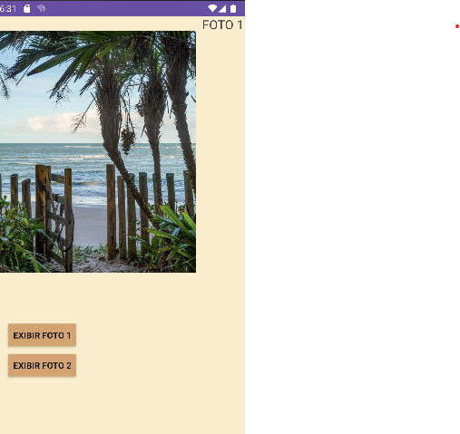
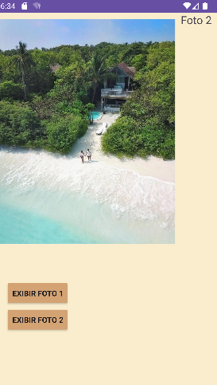

# trocadetelas
<h1>SOBRE O PROJETO:</h1>

O projeto tem como propósito intensificar a aprendizagem de java, foi feito um app para "trocar" de telas onde as imagens  assim visualizando imagem diferentes  ;

<h1>TELA DO PROJETO</h1>

  
   
  

